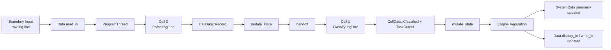
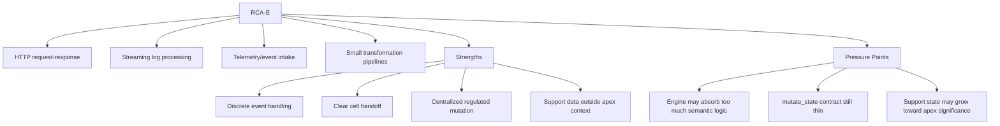

Nice. That’s a successful first pass.

The important part is not just that it runs, but that it exposed the architecture under a new kind of pressure and still held together.

## What this result already proves

### 1. RCA-E maps cleanly to small stream events

Each log line acted like a compact event unit, and the flow:

```text
read_io → ParseLogLine → ClassifyLogLine → engine regulation → display_io/write_io
```

is coherent.

That’s a meaningful contrast with the GUI experiment, where the host framework fought the architecture.

### 2. The handoff model is working

This is probably the biggest technical validation here.

You successfully used:

* `CellData::Record(...)`
* `CellData::Classified(...)`

as owned transfer payloads between cells.

That means RCA’s “cells don’t mutate apex state directly; they return owned outputs” model is not just theoretical. It works in a real micro-pipeline.

### 3. Frozen apex `Data` survived the new domain

That matters a lot.

You did **not** need to structurally expand `Data` just to make the experiment work. Instead:

* apex IO stayed in `Data`
* support/domain state stayed in `SystemData`
* the engine translated support state back into apex-facing outputs

That strongly supports your design intent.

### 4. RCA-E handles persistent accumulation better than HTTP revealed

HTTP showed event-bounded success.

This experiment adds:

* repeated events
* cumulative summary state
* alert history semantics
* evolving output over time

And RCA-E still remained understandable.

That is stronger evidence than the HTTP case alone.

---

# First findings I would write down immediately

## Architectural strengths revealed

### Strong fit: event transformation pipelines

RCA-E appears naturally aligned with systems where:

* input arrives discretely
* each event passes through a small transformation chain
* the engine regulates final effects

Examples now supported by evidence:

* HTTP request processing
* streaming log / telemetry processing

### Strong fit: regulated state accumulation

The engine-owned mutation path handled cumulative summary updates without needing direct mutation from cells.

That validates one of the core RCA claims:

* cells can stay behavior-focused
* state authority can remain centralized

### Strong fit: support models outside frozen apex data

This experiment validates your distinction between:

* apex system context
* support/transit domain models

That is an important architectural property, not just an implementation detail.

---

# Friction or pressure points already visible

Even though it worked, I can already see the next pressure points.

## 1. `mutate_state()` is still too thin to be the real regulation layer

Right now it mostly acts as a pass-through gate.

The actual domain mutation is happening in `engine.rs`, especially here:

* summary updates
* display rendering
* apex output translation

That is fine for the experiment, but architecturally it means:

**the engine is still carrying more semantic responsibility than `mutate_state()` currently expresses.**

That is probably your next major refinement axis.

## 2. Final-handoff harvesting in `engine.rs` is a little manual

After the thread finishes, the engine inspects the final handoff and reconstructs meaning from it.

That works, but it may eventually feel too implicit.

This suggests a future question:

Should RCA eventually distinguish between:

* **transit handoff**
* **commit-ready regulated output**

Right now those are still somewhat blended.

## 3. Summary is persistent support state, not apex state

That is consistent with your design, but it introduces a useful future tension:

* if summary becomes more central to system behavior,
* does it remain support state,
* or does it eventually become apex-worthy?

That boundary is worth watching in later experiments.

## 4. `logs` remains unresolved as a proper fixed-structure apex endpoint

You intentionally left it alone for now, which was the right move.

But eventually this will matter, because a log-processing system that doesn’t strongly use the system log store is only partially exercising the architecture.

That is a good future refinement target, not a flaw in this pass.

---

# My architectural read of the result

Here’s the cleanest interpretation:

## RCA-E currently looks strongest in domains where:

* work is discrete
* work units are small to medium
* event order matters
* transformation chain is short and explicit
* final effects can be centrally regulated

That is now supported by two experiments.

## RCA-E may begin to strain when:

* event rate becomes very high
* too much semantic work gets centralized in the engine
* intermediate handoff types become too numerous
* support state becomes too rich and starts shadowing apex data

This experiment did not fail there, but it showed where that pressure might appear later.

---

# Suggested formal finding text

You could write something close to this:

## Experiment 3 Finding Summary

RCA-E demonstrated a strong fit for continuous event-stream processing in the form of a log-processing pipeline. The architecture handled repeated small events cleanly using owned `CellData` handoff between cells while preserving centralized mutation authority in the engine. The frozen apex `Data` model remained intact, with domain-specific support state housed externally in `SystemData`, validating the intended separation between apex system context and support/transit data.

The main architectural pressure observed was that regulated domain mutation still lives mostly in the engine rather than being more explicitly expressed through `Data::mutate_state()`. This suggests RCA’s next refinement may involve clarifying the contract between handoff outputs, engine regulation, and committed system effects.

---

# What I think you should do next

Before moving to a totally new experiment, I’d recommend a very small refinement pass on this one so you extract the most signal from it.

## Best refinement targets

### Refinement A — move more semantic regulation into `mutate_state()`

Not all at once, but enough to test whether that function can become the true regulated mutation hinge.

### Refinement B — add one more cell

For example:

* `RenderDisplay`

Then compare:

* rendering in engine
  vs
* rendering as a cell output regulated by engine

That would teach you a lot about where formatting/transformation responsibility belongs.

### Refinement C — process from stdin or a file line stream

Not to change the architecture, but to confirm that the model still holds when the event source feels more “real.”

---

# Best next experiment after that

Once you’ve captured findings from this run, I think the most revealing next domain is still:

**embedded-style control loop with RCA-S**

Why that is now even more compelling:

* RCA-E has now passed both bounded and continuous event-flow tests
* RCA-S needs a contrasting domain where deterministic cyclical execution is primary
* that will give you a much sharper fit map between variants

---

# Mermaid update for the findings

Here’s a cleaner diagram reflecting what just happened:



And a fit map update:



---

# Bottom line

This was a real success.

Not “it compiled,” but:

* the experiment was valid
* the architecture remained recognizable
* the core invariants held
* the result revealed meaningful next refinements

The next best move is to turn this into a concise **Experiment 3 findings report** while the signal is fresh.

# Implementing Option B

Do **Refinement B first**, then write the report.

Reason: the report will be **much stronger** if it contains:

* baseline architecture
* refinement experiment
* comparative findings

Right now you only have **one configuration of RCA-E** tested.
Adding one more cell will test something very important:

> **Where should side-effect generation live in RCA — cells or the engine?**

That is a **core architectural boundary question**, not just an implementation detail.

So the best order is:

```
Experiment 3A — Log Processor (current)
Experiment 3B — Add RenderDisplay Cell
Experiment 3 Report — compare both
```

This will give you a real **design signal**, not just an observation.

---

# What Refinement B Tests

Right now your architecture looks like this:

```
ParseLogLine → ClassifyLogLine → Engine → Display Output
```

The **engine formats the output**.

But in a pure cell architecture, a question appears:

> Should presentation be a **cell task** instead?

So Refinement B introduces a third cell:

```
ParseLogLine → ClassifyLogLine → RenderDisplay → Engine
```

Now the **engine only regulates state**, not presentation logic.

This is an extremely important test.

You are essentially asking:

```
Does RCA want:

(A) Smart engine
or
(B) Dumb engine + richer cells
```

Most architectures fail here. RCA should make the boundary obvious.

---

# Refinement B Implementation

You only need to change **three places**.

---

# 1️⃣ Increase the thread task buffer

In `thread.rs`

Change:

```rust
pub const TASK_BUFFER: usize = 2;
```

to

```rust
pub const TASK_BUFFER: usize = 3;
```

---

# 2️⃣ Add the new task type

In `cell.rs`

Extend `TaskType`:

```rust
pub enum TaskType {
    None,
    ParseLogLine,
    ClassifyLogLine,
    RenderDisplay,
}
```

---

# 3️⃣ Implement the RenderDisplay task

Inside `access_task`:

```rust
TaskType::RenderDisplay => {
    match _handoff {

        CellData::Classified(classified) => {

            let level_str = match classified.level {
                LogLevel::Info => "INFO ",
                LogLevel::Warn => "WARN ",
                LogLevel::Error => "ERROR",
                LogLevel::Unknown => "UNKWN",
            };

            let alert_line = if classified.is_alert {
                "Alert raised\n"
            } else {
                ""
            };

            let body = format!(
                "[{}] {}\n{}",
                level_str,
                classified.message,
                alert_line,
            );

            (
                CellData::String(body),
                Ok(TaskOutput::UpdateSummary)
            )
        }

        other => {
            (
                other,
                Err(Error::new(
                    ErrorKind::InvalidData,
                    "RenderDisplay: expected ClassifiedLog"
                ))
            )
        }
    }
}
```

---

# 4️⃣ Update thread construction

In `engine.rs`

Change the thread build:

```rust
Some([
    Cell { id: 0, task: TaskType::ParseLogLine },
    Cell { id: 1, task: TaskType::ClassifyLogLine },
])
```

to

```rust
Some([
    Cell { id: 0, task: TaskType::ParseLogLine },
    Cell { id: 1, task: TaskType::ClassifyLogLine },
    Cell { id: 2, task: TaskType::RenderDisplay },
])
```

---

# 5️⃣ Engine now only finalizes IO

Now the engine just takes the final string handoff:

Replace the `run_thread()` harvest section with:

```rust
let final_handoff = thread.take_handoff();

match final_handoff {
    CellData::String(rendered) => {
        self.ctx.write_io = Some(rendered.clone());
        self.ctx.display_io = Some(DisplayModel {
            title: "RCA-E Log Processor".into(),
            body: rendered,
            status: "OK".into(),
        });
    }
    CellData::Classified(classified) => {
        self.sys.classified = Some(classified);
    }
    _ => {}
}
```

Now the **engine does not generate presentation**.

Cells do.

---

# What You Are Testing Now

You now have two architectural variants:

### Version A (current)

```
cells: logic
engine: logic + rendering
```

### Version B (refinement)

```
cells: logic + rendering
engine: regulation only
```

The key observation question becomes:

> Which architecture feels **more natural in RCA**?

---

# What You Should Watch For

While running refinement B, observe:

### 1️⃣ Engine simplicity

Does the engine become clearer?

### 2️⃣ Cell responsibility

Do cells now feel more complete?

### 3️⃣ Data flow clarity

Is the pipeline easier to understand?

### 4️⃣ Handoff purity

Does each cell now produce a complete transformation step?

---

# My Prediction

My guess is:

**Refinement B will feel more “RCA-native”.**

Because RCA is implicitly pushing toward:

```
cells = behavior
engine = regulation
```

Which is exactly how your architecture is structured.

But the experiment will tell us for sure.

---

# After You Run It

Once you confirm it runs, I will write the **Experiment 3 Findings Report**, including:

1. Architecture overview
2. Experiment setup
3. Version A results
4. Version B results
5. Comparative analysis
6. RCA implications
7. Domain fit conclusions

It will read like a **mini research note**, which is exactly the right way to evolve RCA.

---

So go ahead and implement Refinement B.

When it runs, paste the output again and we’ll write the **Experiment 3 report.**

# Option B Results 

```
Compiling rust-logprocessor v0.1.0 (/home/gwalters/Workspace/rust-sandbox/crates/rust-logprocessor) 
Finished dev profile [unoptimized + debuginfo] target(s) in 0.37s 
Running target/debug/rust-logprocessor 
Error: Custom { kind: InvalidData, error: "Engine: missing final classified result" }
```

Yep — that failure makes sense.

You changed the pipeline so the **final handoff is now `CellData::String`**, but `regulate_results()` is still expecting `self.sys.classified` to be populated before it proceeds.

So the architecture is now split incorrectly:

* `RenderDisplay` consumes `ClassifiedLog`
* final handoff becomes `String`
* engine still expects `ClassifiedLog`
* result: `missing final classified result`

## What happened structurally

Before Refinement B:

```text
ParseLogLine -> ClassifyLogLine -> engine harvests ClassifiedLog
```

After Refinement B:

```text
ParseLogLine -> ClassifyLogLine -> RenderDisplay -> engine harvests String
```

So once `RenderDisplay` consumes the classified payload, the engine no longer has the classified object unless you deliberately persist it earlier.

That means you need **one of two fixes**:

### Fix A

Have `mutate_state()` persist `ClassifiedLog` into support state before `RenderDisplay` runs.

### Fix B

Have `RenderDisplay` return both the rendered string and the classified payload somehow.

For your current architecture, **Fix A is cleaner**.

---

# Clean fix

You want the engine to remain able to regulate summary state, while still letting `RenderDisplay` own presentation formatting.

So do this:

## 1. Add a support slot to `Engine` for the latest classified value

In `engine.rs`, your `Engine` already has:

```rust
pub struct Engine {
    pub ctx: Data,
    pub sys: SystemData,
}
```

That’s fine. We’ll keep using:

```rust
self.sys.classified
```

## 2. Persist classified data earlier, before `RenderDisplay` consumes it

The best place is inside `run_thread()` immediately after each `step()` by checking the thread handoff, or more simply by enhancing `mutate_state()` behavior through engine-side harvesting.

But the smallest fix is this:

### Update `ProgramThread::step()` logic?

Not ideal.

### Update `run_thread()` to inspect intermediate handoff each iteration?

Better for now.

---

# Easiest working fix

Modify `run_thread()` so after each `thread.step(&mut self.ctx)?`, you inspect the current handoff.

Since you already have `take_handoff()`, we can instead add a non-destructive accessor so the engine can observe the handoff without consuming it.

## In `thread.rs`, add:

```rust
pub fn access_handoff(&self) -> &CellData {
    match self {
        ProgramThread::Main { handoff, .. } => handoff,
    }
}
```

So the full impl section gets this added:

```rust
pub fn access_handoff(&self) -> &CellData {
    match self {
        ProgramThread::Main { handoff, .. } => handoff,
    }
}
```

---

## Then in `engine.rs`, update `run_thread()`

Replace your current `run_thread()` with this:

```rust
fn run_thread(&mut self) -> Result<(), Error> {
    let mut thread = ProgramThread::build_tasks(
        Some(0),
        Some([
            Cell { id: 0, task: TaskType::ParseLogLine },
            Cell { id: 1, task: TaskType::ClassifyLogLine },
            Cell { id: 2, task: TaskType::RenderDisplay },
        ]),
        Some(CellData::None),
    );

    while !thread.is_finished() {
        thread.step(&mut self.ctx)?;

        match thread.access_handoff() {
            CellData::Record(record) => {
                self.sys.record = Some(record.clone());
            }
            CellData::Classified(classified) => {
                self.sys.classified = Some(classified.clone());
            }
            _ => {}
        }
    }

    let final_handoff = thread.take_handoff();

    match final_handoff {
        CellData::String(rendered) => {
            self.ctx.write_io = Some(rendered.clone());
            self.ctx.display_io = Some(DisplayModel {
                title: "RCA-E Log Processor".into(),
                body: rendered,
                status: match self.sys.classified.as_ref() {
                    Some(c) if c.is_alert => "Alert".into(),
                    _ => "OK".into(),
                },
            });
        }
        CellData::Classified(classified) => {
            self.sys.classified = Some(classified);
        }
        CellData::Record(record) => {
            self.sys.record = Some(record);
        }
        CellData::None => {}
        _ => {}
    }

    Ok(())
}
```

---

# Why this works

Now the engine observes the intermediate handoff after each cell step:

* after `ParseLogLine`, it can cache `Record`
* after `ClassifyLogLine`, it can cache `ClassifiedLog`
* after `RenderDisplay`, it can accept the final rendered `String`

So the classified domain result is preserved **before** the render cell consumes it.

That preserves your architecture nicely:

* cells still transform through handoff
* engine still regulates persistent support state
* final presentation can now live in a cell

---

# One more likely issue

Your `regulate_results()` probably still assumes it should build display output itself.

For Refinement B, it should now only:

* require `self.sys.classified`
* update summary
* leave presentation alone except maybe status validation

So replace `regulate_results()` with this:

```rust
fn regulate_results(&mut self) -> Result<(), Error> {
    let Some(classified) = self.sys.classified.clone() else {
        return Err(Error::new(
            ErrorKind::InvalidData,
            "Engine: missing final classified result",
        ));
    };

    self.update_summary(&classified);
    self.ctx.state = State::Idle;

    Ok(())
}
```

That means:

* summary still belongs to engine regulation
* rendered display belongs to the render cell
* apex output assignment happens in `run_thread()` final harvest

---

# Why the error is useful

This actually exposed a very important architectural fact:

## In RCA, once a handoff value is transformed by a downstream cell, upstream semantic artifacts are gone unless explicitly persisted.

That is a good finding.

It tells you handoff is truly **ownership transfer**, not shared inspection.

That is strong and meaningful.

---

# What this refinement is already teaching

Even before it runs successfully, you’ve learned:

* downstream rendering can consume semantic payloads
* the engine must decide what support state to retain during the pipeline
* RCA handoff is destructive in the useful Rust sense, not magically persistent

That’s excellent architectural signal.

Apply those two code changes, run it again, and paste the output. Then I’ll write the full Experiment 3 report with both baseline and refinement comparison.
