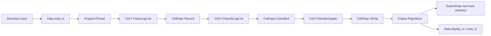
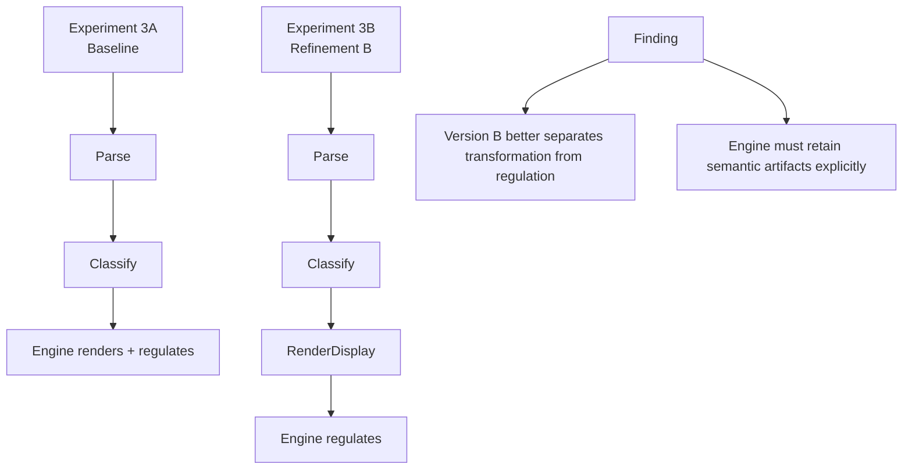

Excellent. Now we have a real Experiment 3, not just a single run.

You tested:

* **Version A** — engine-owned rendering
* **Version B** — render output as a dedicated cell

That is enough to write a meaningful findings report.

# Experiment 3 Findings Report

## RCA-E Streaming Log Processor

### Author

Gavin Walters

### Date

March 11, 2026

---

## 1. Objective

The purpose of Experiment 3 was to stress-test **RCA-E** in a domain different from both GUI applications and HTTP request/response handling.

The selected domain was a **streaming log processor**, chosen to test:

* continuous event flow rather than bounded request/response
* repeated small event transformations
* cumulative state over time
* regulated mutation under persistent operation
* the boundary between cell behavior and engine responsibility

The experiment was intentionally kept small in scope to maximize architectural signal while minimizing application complexity.

---

## 2. Architectural Context

RCA follows the general flow:

```text
Data → State → Threads → Cells → Engine
```

For this experiment, the important architectural constraints were:

* `Data` remains the **frozen apex system context**
* cells may access context, but do not directly own system mutation as an architectural principle
* cells pass owned data forward through `CellData`
* the engine remains the authority for regulated mutation and persistent state updates
* domain-specific support models may exist outside apex `Data` where appropriate

This experiment specifically validated the distinction between:

* **apex context** (`Data`)
* **support/transit domain data** (`LogRecord`, `ClassifiedLog`, `SummaryState`, `SystemData`)

---

## 3. Domain Under Test

The system processes log lines such as:

```text
INFO Boot complete
WARN Temperature rising
ERROR Sensor timeout
INFO Retry started
ERROR Sensor timeout
TRACE Something odd happened
```

The implemented pipeline was:

```text
Raw input line
→ ParseLogLine
→ ClassifyLogLine
→ (optional) RenderDisplay
→ Engine regulation
→ output + cumulative summary
```

Supported outputs included:

* parsed log classification
* alert indication for error events
* cumulative summary counts
* last error tracking

---

## 4. Implementation Structure

### Apex RCA context

The frozen apex context remained:

* `read_io`
* `write_io`
* `display_io`
* `logs`
* `perf`
* introspection fields
* `state`

### Support data models

The experiment used the following support/domain models:

* `RawLine`
* `LogRecord`
* `ClassifiedLog`
* `SummaryState`
* `SystemData`

These supported cell behavior and engine regulation without expanding apex `Data`.

### Cells used

#### Baseline Version A

* `ParseLogLine`
* `ClassifyLogLine`

#### Refinement B / Version B

* `ParseLogLine`
* `ClassifyLogLine`
* `RenderDisplay`

### Thread model

A single logical thread was used.

No OS threads or async runtime behavior were introduced.

---

## 5. Version A — Baseline Configuration

### Structure

```text
ParseLogLine → ClassifyLogLine → Engine
```

In this configuration:

* cells transformed the event
* the engine interpreted the final classified output
* the engine updated summary state
* the engine generated display/write output

### Result

The system executed correctly and produced cumulative summaries for all events.

### Architectural observation

This established that RCA-E can cleanly support:

* repeated event intake
* transformation through owned handoff
* centralized regulated mutation
* cumulative support-state updates

This was the first proof that RCA-E works not only for bounded request/response systems, but also for ongoing event streams.

---

## 6. Version B — Refinement B Configuration

### Structure

```text
ParseLogLine → ClassifyLogLine → RenderDisplay → Engine
```

In this refinement:

* presentation formatting moved into a dedicated cell
* the engine no longer generated formatted output directly
* the engine continued to regulate persistent support state such as summary totals

### Initial failure

The first attempt failed with:

```text
Engine: missing final classified result
```

This happened because:

* `RenderDisplay` consumed `ClassifiedLog`
* the final handoff became `CellData::String`
* the engine still expected `ClassifiedLog` at the end of the pipeline

### Meaning of the failure

This was not merely a bug. It revealed an important RCA property:

> handoff in RCA is a true ownership transfer, not a shared persistent view.

Once a downstream cell transforms owned handoff data, upstream semantic data is no longer available unless it has been explicitly retained by the engine.

### Fix

The engine was updated to observe intermediate handoff values during thread execution and retain support-domain artifacts such as:

* latest `LogRecord`
* latest `ClassifiedLog`

This allowed the engine to preserve semantic state for regulation while still allowing a downstream render cell to consume and transform the final handoff.

### Final result

After that fix, Version B executed correctly and produced the same visible output as Version A.

---

## 7. Observed Runtime Output

Representative output:

```text
[INFO ] Boot complete
Summary: total=1 info=1 warn=0 error=0 unknown=0

[WARN ] Temperature rising
Summary: total=2 info=1 warn=1 error=0 unknown=0

[ERROR] Sensor timeout
Alert raised
Summary: total=3 info=1 warn=1 error=1 unknown=0 last_error="Sensor timeout"
```

The final sequence correctly accumulated:

* total processed count
* info count
* warn count
* error count
* unknown count
* last error message

---

## 8. Key Findings

### Finding 1 — RCA-E fits continuous event transformation well

RCA-E demonstrated a strong fit for small, repeated event pipelines.

The architecture handled:

* per-event transformation
* repeated execution
* cumulative support-state updates
* clean event-by-event output

This is a stronger result than the HTTP experiment because the system now had to sustain state over time rather than simply process isolated requests.

---

### Finding 2 — Owned handoff between cells is viable and useful

The `CellData` handoff mechanism worked well in practice.

Specifically:

* `ParseLogLine` produced `CellData::Record`
* `ClassifyLogLine` consumed that and produced `CellData::Classified`
* `RenderDisplay` consumed classified data and produced `CellData::String`

This validates RCA’s idea that cells can remain focused on transformation while the engine regulates lasting effects.

---

### Finding 3 — Frozen apex `Data` remained intact across a new domain

The experiment succeeded without structurally expanding the apex `Data` model.

Instead:

* apex IO remained in `Data`
* domain-specific support data lived in `SystemData`
* the engine translated support results back into apex-facing outputs

This strongly validates the RCA distinction between:

* apex system context
* support/transit domain data

---

### Finding 4 — RCA handoff semantics are strongly ownership-based

Refinement B exposed a key property:

When a downstream cell consumes and transforms handoff data, earlier semantic artifacts are gone unless explicitly retained elsewhere.

This implies that RCA handoff is not merely “message passing,” but **ownership-bearing transfer** with real architectural consequences.

That is a meaningful strength because it keeps the pipeline honest and explicit.

---

### Finding 5 — Engine responsibility is still the main pressure point

The experiment also exposed a clear pressure area:

Although the engine is correctly the mutation authority, it still carries significant semantic responsibility, including:

* summary regulation
* support-state retention
* final output coordination

Version B reduced some engine responsibility by moving rendering into a cell, but the engine still remains the main architectural concentration point.

This suggests the next RCA refinement area is not whether the engine should regulate state, but:

> how explicit and well-factored that regulation contract should become.

---

## 9. Comparison: Version A vs Version B

### Version A — Engine-owned rendering

**Strengths**

* simpler pipeline
* fewer cells
* straightforward execution

**Weaknesses**

* engine absorbs presentation logic
* less clear separation between transformation and regulation

### Version B — Render cell added

**Strengths**

* clearer pipeline semantics
* cells own more of the transformation chain
* engine becomes more purely regulatory
* better alignment with cell-oriented architectural thinking

**Weaknesses**

* requires engine retention of intermediate semantic artifacts
* exposes the need for clearer rules around what the engine must persist during execution

### Overall comparison

Version B felt more architecturally revealing.

Even though it required a fix, that fix exposed a core RCA property rather than merely patching an implementation flaw.

This suggests that **RenderDisplay as a cell is the more RCA-native direction**, provided the engine has a clear mechanism for retaining support-state artifacts needed for later regulation.

---

## 10. Architectural Implications for RCA

### Implication 1 — RCA-E is now validated in two strong domains

RCA-E has now shown good fit in:

* HTTP request/response processing
* streaming log/event processing

This suggests RCA-E is well-suited to systems where:

* input arrives as discrete events
* event order matters
* transformations are explicit and staged
* the engine can centrally regulate final effects

---

### Implication 2 — `mutate_state()` may need to evolve

At present, `mutate_state()` still behaves more like a handoff/regulation gate than a rich mutation language.

The deeper state semantics still largely live in the engine.

This suggests a future RCA refinement may involve making regulated outputs more expressive so that the engine can remain authoritative without becoming semantically overloaded.

---

### Implication 3 — Support-state retention is now an explicit design concern

Refinement B revealed a new architectural question:

> what support-domain artifacts must the engine retain during cell execution?

This is now a real RCA design issue, especially for pipelines where downstream cells consume transformed ownership.

---

### Implication 4 — Cell boundaries matter

Moving rendering into a cell improved the architectural clarity of the pipeline.

This suggests RCA benefits when:

* cells represent meaningful transformation stages
* engine owns regulation, not all domain behavior
* pipeline steps remain explicit and inspectable

---

## 11. Domain Fit Conclusion

Based on Experiments 2 and 3, RCA-E currently appears strongest for:

* request-driven systems
* event intake pipelines
* telemetry or log processors
* small-to-medium transformation chains
* systems where centralized regulation of lasting effects is valuable

RCA-E appears less proven, and potentially more at risk, in future domains involving:

* very high event throughput
* many branching handoff types
* highly parallel coordination
* cases where support-state retention becomes too complex or implicit

---

## 12. Final Assessment

Experiment 3 was successful.

Not merely because the code ran, but because it produced useful architectural evidence.

The experiment showed that RCA-E can support a continuous event-stream domain while preserving:

* frozen apex context
* owned handoff between cells
* centralized mutation authority
* support data external to apex state

The most important refinement signal was the discovery that downstream cell transformation can consume semantic artifacts that the engine may still need. This makes support-state retention a first-class RCA concern and points toward future refinement of engine regulation contracts.

Overall, Experiment 3 strengthens the case that RCA-E is a natural fit for event-driven transformation systems and provides a clear path for refining the relationship between cells, handoff, and engine regulation.

---

## 13. Recommended Next Step

The next best step is to continue into a contrasting domain using **RCA-S**, preferably an:

**embedded-style control loop** or **deterministic cyclical simulator**

This would provide a useful contrast against RCA-E by testing:

* architecture-owned loop control
* deterministic step order
* repeated cycle execution
* state progression under sequential control rather than event intake

---

# Mermaid diagram for the report

## Experiment 3 final structure



## Baseline vs refinement comparison



