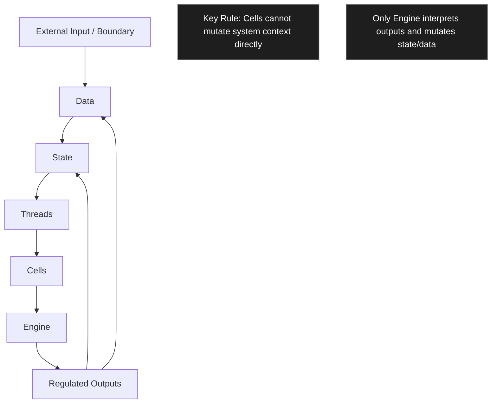
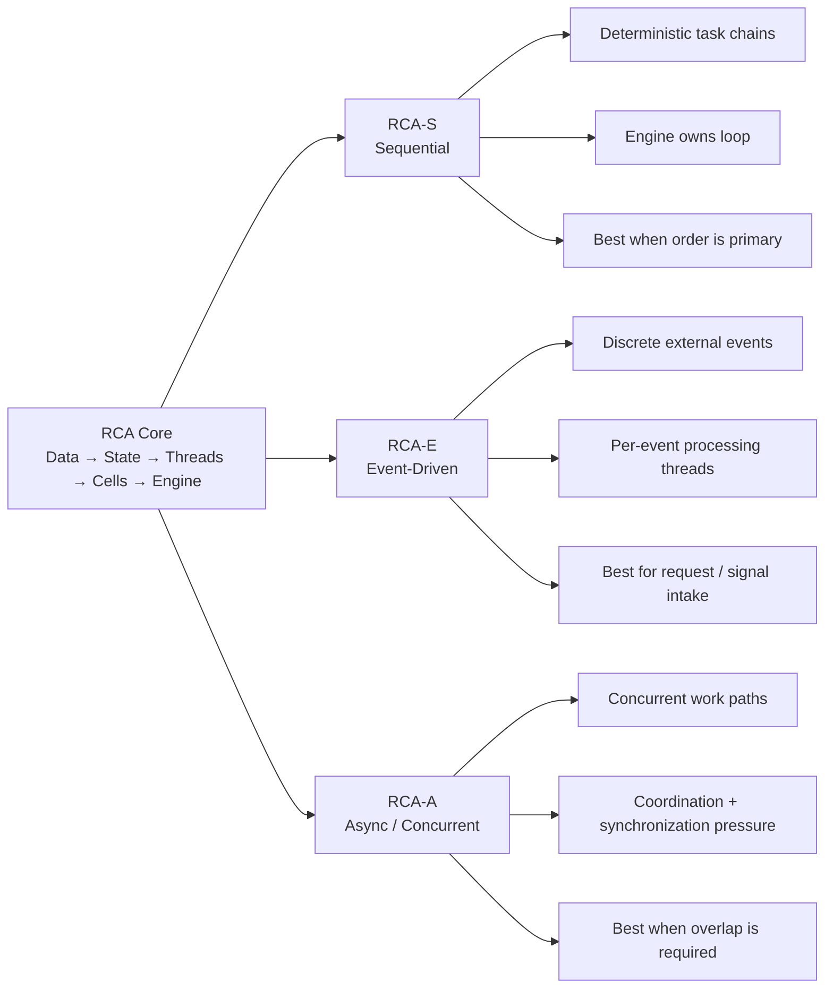
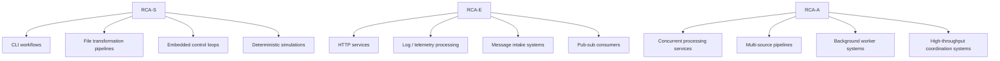
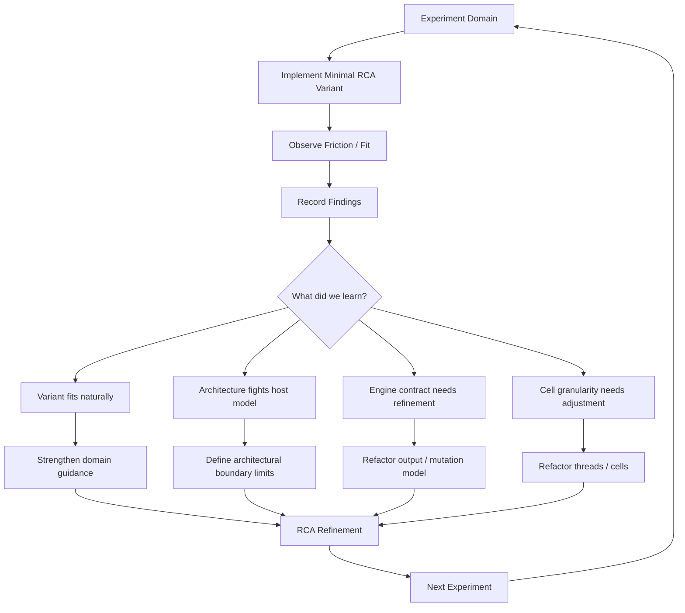
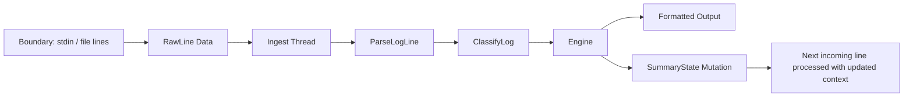

Your instinct is correct: if you want RCA to mature as an architecture, the next experiments should **attack its weak points first**, not confirm its strengths. Once the weaknesses are understood and adapted to, the later experiments that align with RCA’s natural strengths will serve as **validation runs**.

The key is choosing domains that introduce **different architectural pressures**. The GUI experiment already revealed one class of pressure: **framework-owned runtime control**.

Below is the most useful progression I’d recommend. This sequence intentionally escalates the kinds of stress RCA will face.

---

# RCA Experiment Sequence

## Experiment 1 - Notepad GUI Application 

### Results 

SUCCESS.

Completed:

* See: RCA-001-GUI-Framework-Test.md

## Experiment 2 — Network Service (HTTP or Socket Server)

Domain pressure introduced:

* asynchronous input
* many independent requests
* unpredictable event timing
* IO latency
* partial concurrency

Typical architecture pressure points:

* event loops
* request lifecycle
* message parsing
* connection handling
* state isolation

Why this is a good next experiment:

It tests whether RCA can handle **many small independent tasks** instead of a single sequential workflow.

Key architectural question:

> Can RCA handle event-driven workloads without collapsing into callback chaos?

Suggested minimal implementation:

* TCP listener
* handle requests sequentially first
* optionally experiment with logical threads per connection

Example application:

```text
RCA HTTP Echo Server
```

Request → task pipeline → response.

### Results 

SUCCESS.

Completed:

* See: RCA-002-HTTP-Server.md

### Next Steps

Continue experimentation with additional domains to stress other aspects of the architecture.

Potential next domains include:

* CLI pipeline systems
* message queue / pub-sub systems
* file processing pipelines
* embedded device control loops

Additional experiments will help determine the boundaries and strengths of each RCA variant.

---

The **next interesting experiment (EXP-003)** is one that will stress RCA in a completely different way:

**a streaming pipeline** (log processor or CLI pipe chain).

It will reveal things about **state persistence, long-running flows, and throughput behavior** that neither the GUI nor HTTP experiments expose.

---

## Experiment 3 — Streaming Data Pipeline

Domain pressure introduced:

* continuous input stream
* staged processing
* throughput vs latency
* backpressure

Example pipeline:

```text
input → parse → transform → output
```

Why this matters:

It tests how well RCA supports **dataflow-style architectures**.

Key architectural question:

> Can RCA represent pipelines cleanly without creating artificial state complexity?

This domain often reveals whether the architecture naturally supports **producer/consumer relationships**.

---

## Experiment 4 — Actor / Message System

Domain pressure introduced:

* independent actors
* message passing
* dynamic scheduling
* system-wide concurrency

Example system:

```text
Actor A → message → Actor B → message → Actor C
```

Why this experiment is valuable:

Actor systems challenge architectures because they force:

* decentralization
* asynchronous communication
* event-driven execution

Key architectural question:

> Can RCA represent distributed logical execution units?

This experiment will strongly test your **logical thread model**.

---

## Experiment 5 — Simulation Engine

Domain pressure introduced:

* deterministic time stepping
* state updates across entities
* high iteration loops
* performance considerations

Example simulation:

```text
entity update → physics → state mutation → render state
```

Why this domain matters:

Simulation engines strongly favor **deterministic sequential execution**, which aligns well with RCA.

Key architectural question:

> Does RCA naturally fit simulation-style update loops?

---

## Experiment 6 — Embedded Hardware Mock

Domain pressure introduced:

* device interaction
* hardware registers
* interrupt-like events
* timing-sensitive behavior

Example:

Simulated device driver system.

Example components:

```text
GPIO
UART
Timer
ADC
```

Why this matters:

This is where RCA **likely shines**, so it serves as validation after earlier stress tests.

---

# Visual Summary

```text
SUCCESS  EXP 1  GUI Framework         (completed)
SUCCESS  EXP 2  Network Service       (async events)
AWAITING EXP 3  Streaming Pipeline    (dataflow)
AWAITING EXP 4  Actor System          (message systems)
AWAITING EXP 5  Simulation Engine     (deterministic loop)
AWAITING EXP 6  Embedded Mock         (architecture home ground)
```

---

# Why this order works

You start with domains that force RCA to confront:

1. framework runtime ownership
2. asynchronous events
3. streaming data
4. distributed task execution

Then you end with domains where RCA is expected to perform well.

That means when the final experiments succeed, you will know they succeeded **after surviving serious pressure**.

---

# Important Experiment Discipline

As you proceed, avoid changing RCA too aggressively between experiments.

A good rule is:

```text
One architectural refinement per experiment.
```

This prevents the architecture from drifting too quickly.

---

# My recommendation for the immediate next experiment

The **Network Service experiment**.

Reason:

It introduces the **largest architectural shift** from the GUI experiment while still being manageable.

It will immediately test:

* event-driven inputs
* task isolation
* message handling
* logical threading concepts

A minimal TCP echo server implemented with RCA would be ideal.

---

# One final suggestion

Start keeping a master index file:

```
RCA_EXPERIMENT_LOG.md
```

Example:

```text
RCA-EXP-001 GUI Notepad
RCA-EXP-002 HTTP Server
RCA-EXP-003 Streaming Pipeline
RCA-EXP-004 Actor System
RCA-EXP-005 Simulation Engine
RCA-EXP-006 Embedded Mock
```

Over time this becomes **evidence of architectural validity**.

---

Here’s the cleanest next move.

## RCA analysis so far

You’ve already exposed two important truths:

**RCA-S** appears strongest when the architecture can own the loop and regulate execution directly. As soon as a framework owns the loop, RCA-S starts fighting the host environment rather than expressing itself naturally.

**RCA-E** appears strong where work arrives as discrete external stimuli, gets transformed through a bounded pipeline, and exits cleanly. HTTP mapped well because request/response is naturally event-bounded and the boundary layer can remain thin.

That suggests the next experiment should **not** be another request/response system and **not** another framework-owned loop. It should stress something RCA has not yet really faced:

**continuous flow with accumulating context over time**.

That is where architecture patterns often reveal whether they are merely elegant in small bounded cases, or actually robust under sustained operation.

## Best next experiment

I recommend:

# Experiment 3 — Log Processing / Stream Pipeline

More specifically:

**A small streaming log processor that tails input lines, parses them, classifies them, updates summary counters, and emits structured output.**

This is better than the other options for the next step because it stresses several new properties at once without becoming a large system.

## Why this is the best next stress test

A log processor reveals architectural properties that GUI and HTTP did not:

### 1. It introduces persistent flow

Unlike HTTP, the system does not begin and end cleanly per request. Data keeps arriving. That tests whether RCA can remain coherent when execution is ongoing rather than episodic.

### 2. It tests accumulation over time

Now your engine has to regulate not just immediate outputs, but evolving state such as counts, rolling summaries, last-seen values, severity totals, or simple alert conditions.

That directly tests your rule:

> Cells can read context, but only the engine mutates state.

This is exactly the kind of pressure that proves whether regulated mutation is a real advantage or just a design preference.

### 3. It stresses throughput and back-to-back events

Even in a tiny prototype, multiple lines arriving in sequence create a stronger rhythm than isolated HTTP requests. This begins to reveal whether your cell structure and engine handoff are too heavy, too coupled, or just right.

### 4. It tests whether RCA-E can handle “micro-events”

A log line is smaller and more repetitive than an HTTP request. That helps answer whether RCA-E remains clear when the event unit becomes very small and frequent.

### 5. It gives you a natural bridge to future domains

A stream processor is structurally adjacent to:

* telemetry pipelines
* embedded message handling
* pub-sub systems
* queue consumers
* simulation traces
* sensor event processing

So even a tiny experiment here has high leverage.

## Why not the others first

A quick ranking:

**Best now:**

* log processing / stream pipeline

**Good after that:**

* embedded device control loop
* simulation system

**Probably later:**

* message queue / pub-sub
* CLI pipeline / file transformation

Why:

* **Embedded control loop** is very important, but it risks pulling in timing, hardware semantics, and control theory too early.
* **Simulation** is also strong, but it can become abstract too quickly and hide the execution pressure you want to observe concretely.
* **Message queue / pub-sub** is valuable, but likely overlaps too much with event routing patterns before you’ve tested continuous flow.
* **CLI/file transformation** is useful, but still too batch-oriented. It won’t push RCA far enough beyond HTTP.

---

# Recommended Experiment 3

## Experiment 3 — Streaming Log Processor (RCA-E)

### Core idea

Read lines from stdin or a test file as a stream.

Each line becomes an event.

Example input:

```text
INFO Boot complete
WARN Temperature rising
ERROR Sensor timeout
INFO Retry started
ERROR Sensor timeout
```

The architecture transforms each line through RCA-E and emits:

* parsed record
* classification
* running summary state
* optional alert output

### What this stresses

* sustained event flow
* regulated state mutation over time
* repeated cell execution
* separation between boundary IO and RCA logic
* whether RCA-E remains clean when events are small and frequent

---

# Minimal implementation plan

Keep it nearly as small as the HTTP experiment.

## Boundary layer

`main.rs` should do only this:

1. read lines from stdin or a fixed sample file
2. pass each raw line into the RCA engine
3. print structured output returned by the engine

That keeps IO outside the architecture.

## Suggested RCA-E flow

```text
RawLine → ParsedLog → ClassifiedLog → Engine-regulated SummaryState
```

## Minimal cells

Put them in `cell.rs`, same as your improved HTTP layout.

### Cell 1 — `ParseLogLine`

Input:

* raw log line

Output:

* parsed structure, maybe:

```rust
struct LogRecord {
    level: LogLevel,
    message: String,
}
```

### Cell 2 — `ClassifyLog`

Input:

* `LogRecord`

Output:

* classification info, maybe:

```rust
struct ClassifiedLog {
    level: LogLevel,
    message: String,
    is_alert: bool,
}
```

### Optional Cell 3 — `RenderOutput`

Input:

* classified record
* current summary snapshot

Output:

* formatted display string

You could also let the boundary render this if you want to keep the experiment tighter.

## Engine responsibilities

The engine should:

* run the cell thread for each incoming line
* interpret returned `TaskOutput`
* update regulated summary state

Example summary state:

```rust
struct SummaryState {
    total: u32,
    info_count: u32,
    warn_count: u32,
    error_count: u32,
    last_error: Option<String>,
}
```

This is where the experiment gets interesting: the cells do not mutate this directly. They only return outputs that the engine interprets.

## Minimal states

Keep state very simple.

```rust
enum SystemState {
    Idle,
    Processing,
    Halted,
}
```

You may not even need much lifecycle complexity here. The important state is the regulated summary data.

## Suggested thread

One logical thread is enough:

```text
IngestThread:
  ParseLogLine → ClassifyLog
```

Or:

```text
IngestThread:
  ParseLogLine → ClassifyLog → RenderOutput
```

## Example outputs

For each input line:

```text
[INFO ] Boot complete
Summary: total=1 info=1 warn=0 error=0

[WARN ] Temperature rising
Summary: total=2 info=1 warn=1 error=0

[ERROR] Sensor timeout
Alert raised
Summary: total=3 info=1 warn=1 error=1 last_error="Sensor timeout"
```

---

# What findings this should reveal

This experiment should help you answer:

### Does RCA-E remain elegant under repeated, ongoing inputs?

HTTP showed it works for bounded events. This tests whether it stays readable when the event loop becomes persistent.

### Is regulated mutation too indirect?

If summary-state updates feel cumbersome, that is a real signal. If they feel clean and auditable, that validates the architecture strongly.

### Are cells at the right granularity?

If a log line feels too small to justify separate cells, RCA may be too ceremonious for high-frequency event streams. That would be valuable to learn.

### Is the engine becoming too interpretive?

If engine logic starts swallowing domain behavior, that may indicate you need a clearer contract between cell outputs and engine mutation rules.

### Does logical threading still make sense under continuous flow?

This is a direct test of your “logical threading over OS threads” principle in a more active environment.

---

# Suggested experiment writeup title

**Experiment 3 — Streaming Log Processor (RCA-E)**
*Subtitle: Stress-testing regulated state mutation under continuous event flow*

---

# Visual architecture map

Below are practical Mermaid diagrams for Obsidian.

## 1. Shared RCA core



## 2. RCA variant comparison



## 3. Domain fit map



## 4. Experiment feedback loop



## 5. Experiment 3 specific map



---

# Practical recommendation

Proceed with:

**Experiment 3 — Streaming Log Processor using RCA-E**

Keep it tiny:

* one boundary input source
* one logical thread
* two cells
* one regulated summary state
* line-by-line output

That will give you the highest signal-to-effort ratio right now.

After that, the most revealing follow-up would probably be:

**Experiment 4 — Embedded-style control loop using RCA-S**

That would create a very strong contrast:

* RCA-E under persistent event flow
* RCA-S under deterministic cyclical control

That pair would tell you a lot about the real boundary between the two variants.

If you want, I can next turn this into a **thread-ready experiment spec** with:

* objective
* scope
* module tree
* Rust type sketch
* expected findings template
