## RCA Family Overview

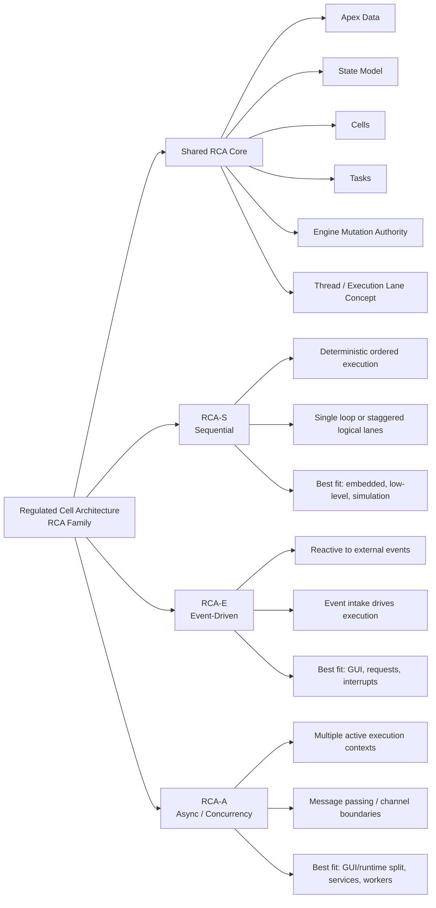

## Shared RCA Core 

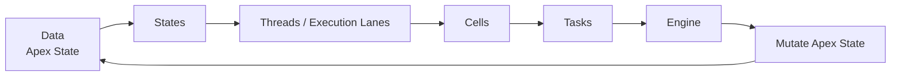

## RCA Iteration Model

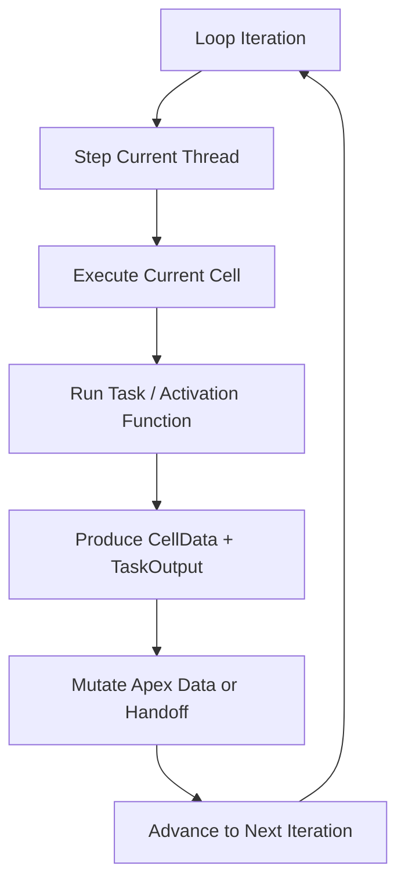

## RCA-S Variant

This shows the sequential variant as the most deterministic and explicit form.

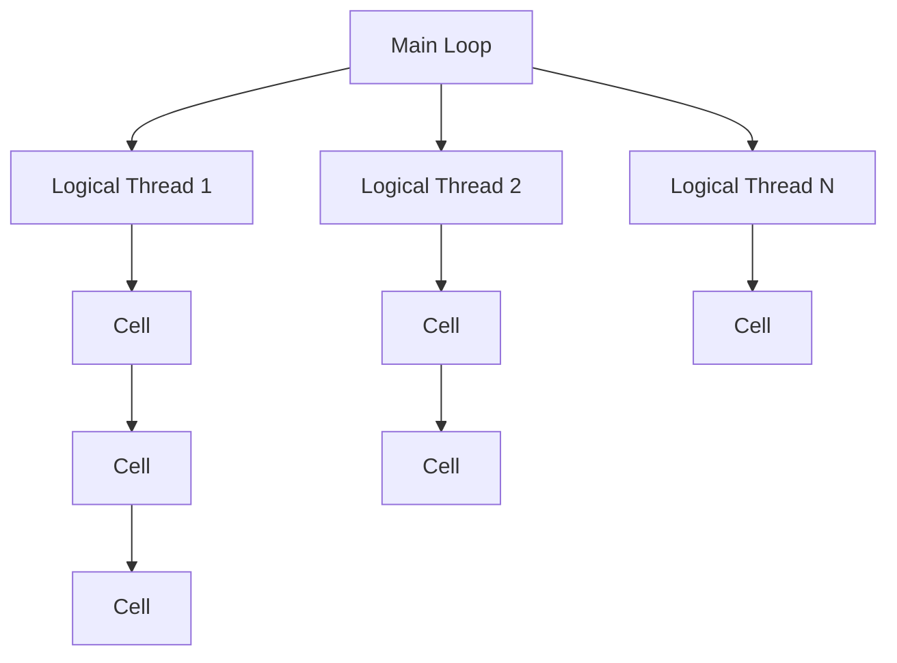

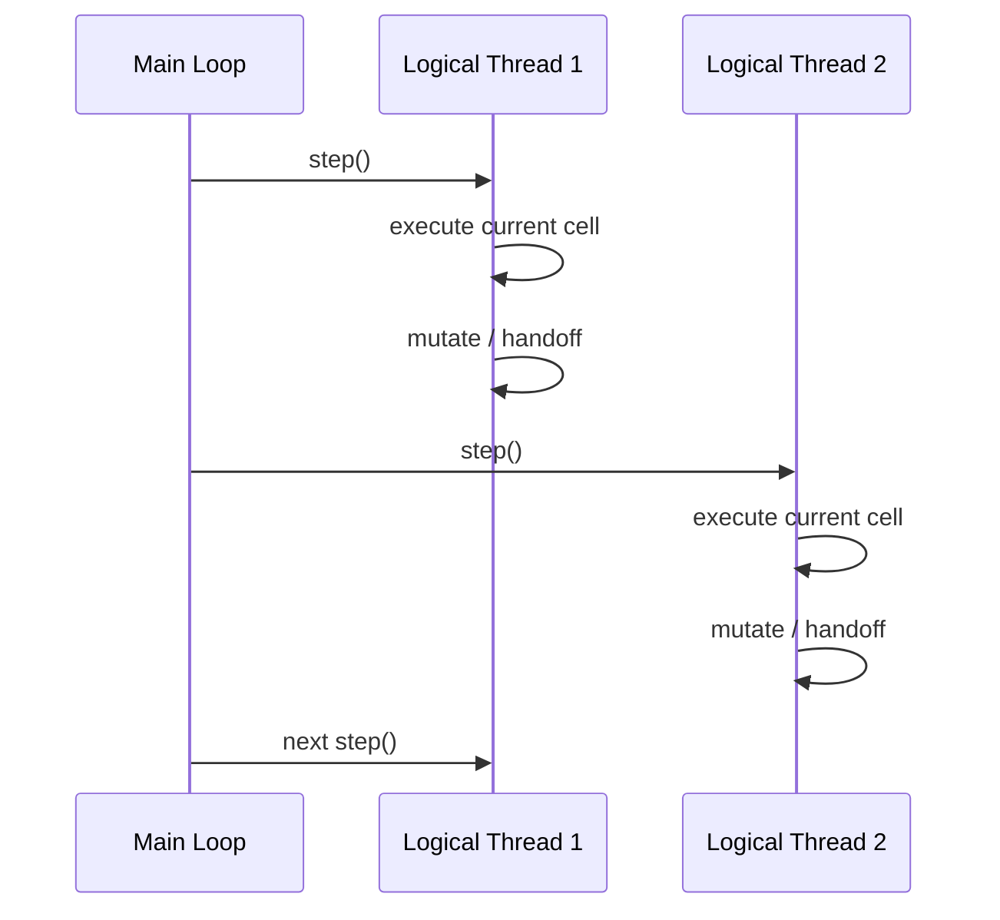

## RCA-A Variant 

This shows the async/concurrency-oriented variant, where multiple active contexts exist but mutation authority still remains regulated.

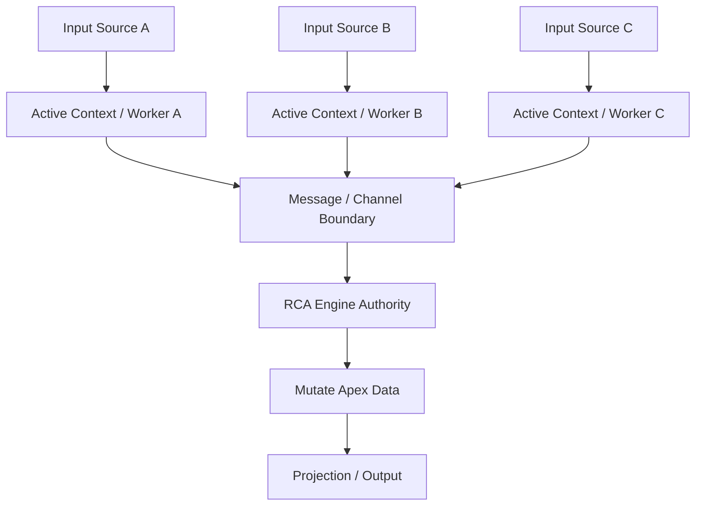

## RCA-E Variant

This shows the event-driven variant, where events become the intake that trigger regulated execution.

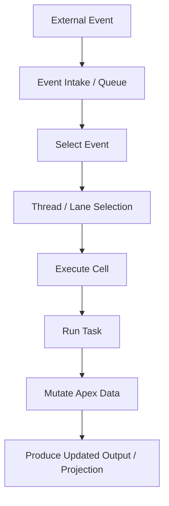

## Variant Selection Workflow

This documents how to think about choosing a variant by domain pressure.

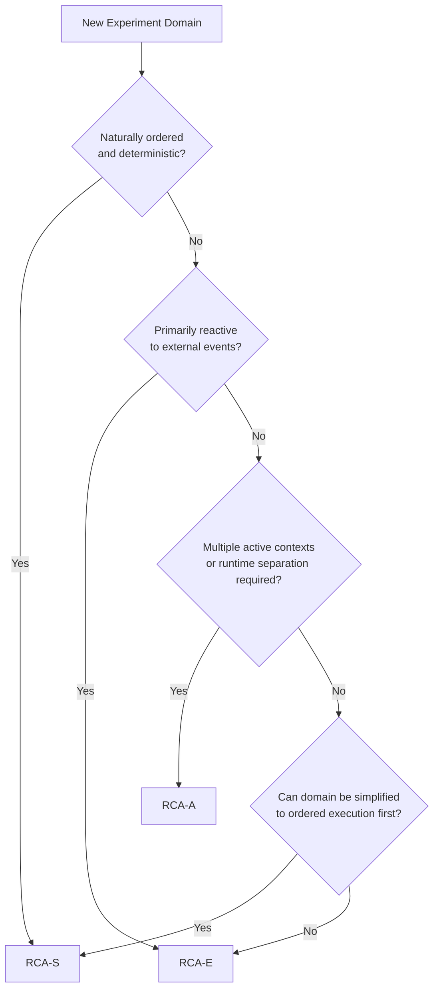

## GUI Experiment Interpretation

This is my current interpretation of what happened in the notepad experiment.

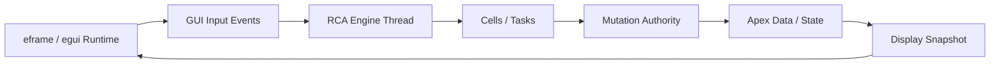

This is the key finding from the experiment:

* GUI runtime can remain a boundary

* RCA remains authoritative

* projected display models bridge the two

## Workflow Between Variants

This one shows the broader lifecycle I'm aiming for: choose variant, run experiment, extract findings, refine family.

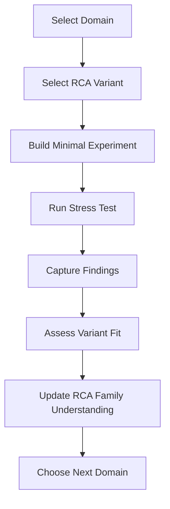

## Practical Domain-to-Variant Map

This is a quick documentation artifact for where the variants currently appear to fit best.

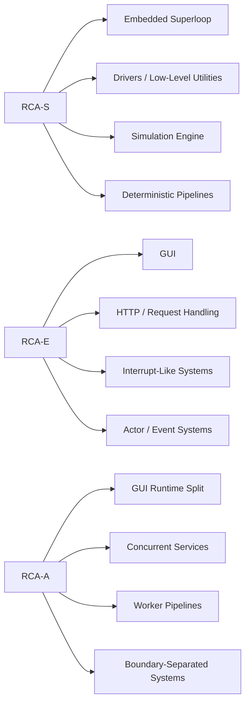