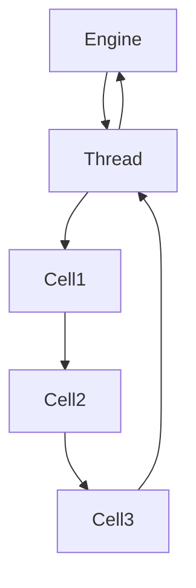
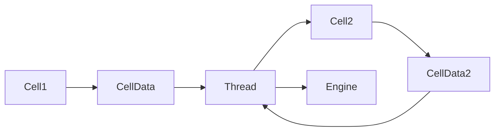
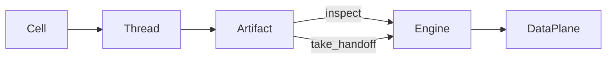
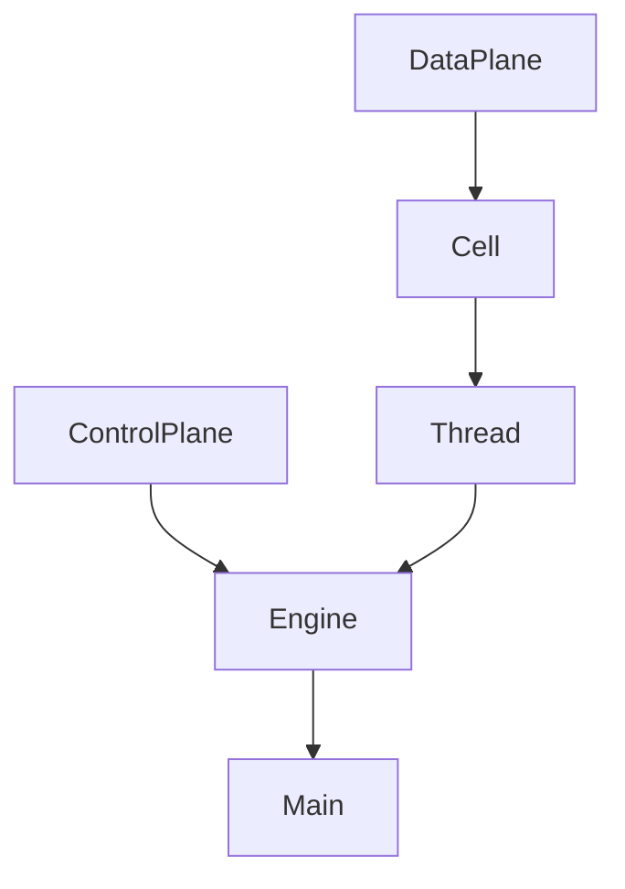
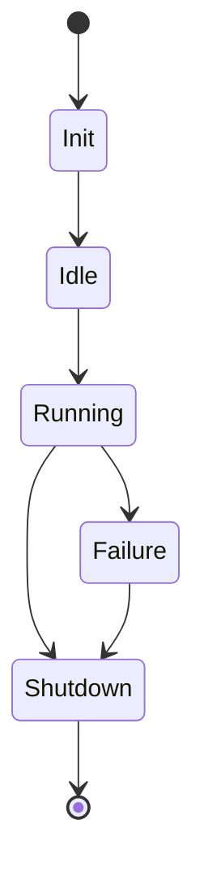
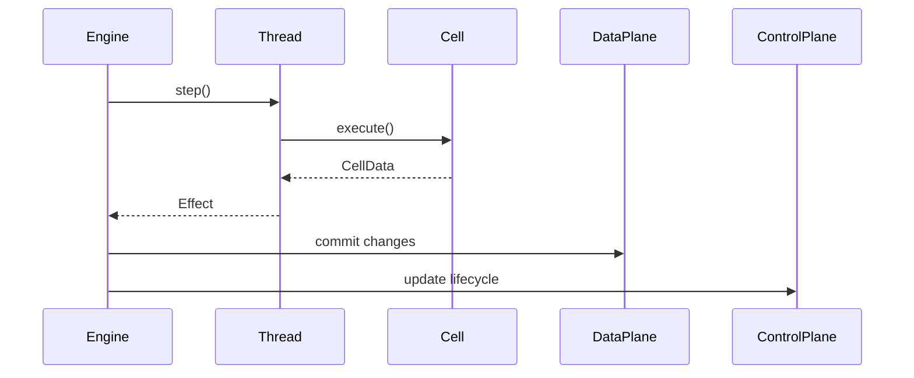

Below is a **robust RCA design document** you can drop directly into a Markdown file (for Obsidian, GitLab, etc.).
It includes:

* philosophy
* principles
* architecture description
* runtime model
* authority model
* artifact flow
* control/data plane separation
* implementation mapping
* Mermaid diagrams

You can save it as something like:

```
docs/rca_design.md
```

---

# Regulated Cell Architecture (RCA)

Author: Gavin Walters
Architecture: Rust Regulated Cell Architecture
Status: Active Development
Date: 2026

---

# 1. Overview

Regulated Cell Architecture (RCA) is a **structured execution architecture** designed to create clear authority boundaries, deterministic execution flow, and explicit artifact movement within software systems.

RCA emphasizes:

* **clear ownership**
* **explicit execution stages**
* **regulated state mutation**
* **minimal authority leakage**
* **artifact continuity**

The architecture organizes runtime behavior into a small set of cooperating primitives:

| Component    | Responsibility                              |
| ------------ | ------------------------------------------- |
| DataPlane    | System working context                      |
| ControlPlane | System lifecycle and governance             |
| Cell         | Atomic computation unit                     |
| Thread       | Execution sequencing and artifact transport |
| Engine       | Runtime authority and commit regulator      |

The guiding idea is simple:

> Cells compute, threads transport, engines decide.

---

# 2. RCA Philosophy

RCA is based on several core philosophical ideas about how software systems should behave.

## 2.1 Authority Must Be Explicit

Many architectures fail because too many components can mutate shared state.

RCA enforces:

* **Cells cannot mutate system context**
* **Threads cannot mutate system context**
* **Only the Engine commits changes**

This prevents authority leakage and keeps system behavior understandable.

---

## 2.2 Artifacts Should Flow

Artifacts generated during computation should naturally propagate forward through the system rather than being constantly interpreted or mutated.

RCA therefore favors:

* **artifact continuity**
* **forward propagation**
* **late interpretation**

---

## 2.3 Computation Should Be Atomic

Cells represent **atomic behavioral units**.

They should:

* perform a small transformation
* return an artifact
* avoid system-level decisions

This keeps behavior modular and predictable.

---

## 2.4 System Meaning Should Be Committed Centrally

Only the engine decides what computation results actually mean for the system.

This allows:

* consistent state mutation
* centralized lifecycle control
* deterministic runtime behavior

---

# 3. RCA Core Components

## 3.1 DataPlane

The **DataPlane** contains the working context of the system.

It represents meaningful operational information used during runtime.

Examples:

* configuration
* IO input/output
* performance data
* logs
* activity state
* display state

Example:

```rust
pub struct DataPlane {
    pub config: ConfigData,
    pub read_io: ReadData,
    pub write_io: WriteData,
    pub perf: PerfData,
    pub logs: LogData,
    pub cells: CellInfo,
    pub activity: ActivityInfo,
    pub display: DisplayInfo,
}
```

### Characteristics

* Passive data store
* No mutation policy
* No lifecycle control
* Accessible by cells (read-only)

---

## 3.2 ControlPlane

The **ControlPlane** governs system lifecycle and operational posture.

Example:

```rust
pub struct ControlPlane {
    pub state: State,
    pub mode: Mode,
    pub event: Event,
}
```

Typical values include:

| Control | Description      |
| ------- | ---------------- |
| State   | Lifecycle stage  |
| Mode    | Operational mode |
| Event   | Runtime signal   |

Example states:

```
Init
Idle
Running
Halt
Failure
Shutdown
```

Only the **Engine** mutates the ControlPlane.

---

## 3.3 Cells

Cells are the smallest executable units in RCA.

Each cell:

* performs one operation
* receives a handoff artifact
* returns the next artifact

Example:

```rust
pub struct Cell {
    pub id: usize,
    pub task: Task,
}
```

Execution:

```rust
pub fn execute(&mut self, context: &DataPlane, handoff: CellData)
    -> Result<CellData, Error>
```

Cells:

* can inspect context
* cannot modify context
* cannot modify control state

They are intentionally **dumb**.

---

## 3.4 Threads

Threads orchestrate the sequential execution of cells.

Responsibilities:

* determine cell execution order
* carry artifacts between cells
* emit execution effects

Example structure:

```rust
pub enum ProgramThread {
    Main {
        counter: usize,
        tasks: [Cell; CELLS],
        handoff: CellData,
    }
}
```

Threads perform execution steps:

```rust
pub fn step(&mut self, ctx: &DataPlane) -> Result<Effect, Error>
```

Threads do **not mutate system context**.

Instead they return an **Effect**.

---

## 3.5 Engine

The **Engine** is the runtime authority.

Responsibilities:

* lifecycle management
* committing system changes
* interpreting effects
* coordinating threads

Example:

```rust
pub struct Engine {
    pub ctx: DataPlane,
    pub ctl: ControlPlane,
    pub sys: SystemData,
}
```

Execution loop:

```rust
loop {
    let effect = thread.step(&self.ctx)?;
    self.ctx.activity = effect.activity;

    if effect.finished {
        self.ctl.state = State::Shutdown;
    }
}
```

Only the engine mutates:

* DataPlane
* ControlPlane

---

# 4. RCA Execution Flow

## Execution Pipeline



The engine drives execution by repeatedly stepping the thread.

---

# 5. Artifact Flow

Artifacts propagate forward through the system.



Artifacts represent transient computation results.

They are not automatically committed to system state.

---

# 6. Effect Propagation

Threads emit effects that inform the engine about execution results.

Example:

```rust
pub struct Effect<'a> {
    pub activity: ActivityInfo,
    pub handoff: &'a CellData,
    pub finished: bool,
}
```

Effect contains:

| Field    | Purpose                |
| -------- | ---------------------- |
| activity | execution description  |
| handoff  | artifact reference     |
| finished | thread completion flag |

Effects allow the engine to interpret execution without granting mutation authority to threads.

---

# 7. Artifact Ownership Model

Artifacts move through three possible states.

## 1. In Transit

Owned by the thread.

Accessed by reference via:

```
access_handoff()
```

---

## 2. Observed

Engine inspects artifact by reference.

No mutation occurs.

---

## 3. Transferred

Ownership transferred via:

```
take_handoff()
```

Only used when durable persistence is required.

---

## Artifact Ownership Diagram



---

# 8. Authority Model

RCA strongly regulates authority boundaries.

| Component | Can Read     | Can Write |
| --------- | ------------ | --------- |
| Cell      | DataPlane    | No        |
| Thread    | DataPlane    | No        |
| Engine    | DataPlane    | Yes       |
| Engine    | ControlPlane | Yes       |

This prevents state corruption and unclear ownership.

---

# 9. Dependency Structure

RCA enforces one-directional dependencies.



Upstream modules never depend on downstream modules.

This eliminates circular architecture.

---

# 10. Runtime Lifecycle

Example runtime lifecycle:



The engine manages lifecycle transitions.

---

# 11. Architectural Principles

## Principle 1 — Passive Data

DataPlane stores working context but does not enforce mutation policy.

---

## Principle 2 — Engine Authority

Only the engine commits meaningful state changes.

---

## Principle 3 — Dumb Cells

Cells should remain small and stateless computation units.

---

## Principle 4 — Artifact Continuity

Artifacts propagate forward by default.

---

## Principle 5 — Thread Sequencing

Threads sequence computation but do not interpret system meaning.

---

## Principle 6 — Selective Artifact Transfer

Artifacts remain thread-owned unless the engine explicitly transfers ownership.

---

# 12. Typical RCA Execution Cycle



---

# 13. Suitable Problem Domains

RCA works particularly well for systems that require:

* staged execution
* regulated state mutation
* deterministic behavior
* centralized authority

Examples include:

* embedded systems
* simulation engines
* CLI pipelines
* system tooling
* data processors
* orchestration systems

---

# 14. Design Strengths

RCA provides:

* clear authority boundaries
* predictable execution flow
* small architecture kernel
* reusable components
* strong debugging visibility

---

# 15. Future Expansion

Potential extensions include:

* multiple thread orchestration
* asynchronous cell execution
* distributed RCA nodes
* dynamic task graphs
* scheduling policies

These features can be added without altering the RCA core.

---

# 16. Summary

RCA organizes software execution around five clear responsibilities:

| Component    | Role                 |
| ------------ | -------------------- |
| DataPlane    | working context      |
| ControlPlane | lifecycle control    |
| Cell         | atomic computation   |
| Thread       | execution sequencing |
| Engine       | system authority     |

The guiding idea remains:

> Cells compute. Threads transport. Engines decide.

---

If you'd like, I can also produce a **second document** that is extremely valuable for long-term projects:

**"RCA Engineering Guide"**

which would include:

* coding conventions
* task patterns
* artifact design guidelines
* engine integration strategies
* real-world usage examples

It would essentially be the **practical handbook for using RCA in real systems.**
